> [!TIP]
>
> Hello Amplicode,
>
> I am a university student from China. First of all, thank you for your efforts. Here is the problem I encountered:
>
> When integrating Flyway through Amplicode, I encountered an `Unsupported Database: PostgreSQL 16.3` error. Below are the steps to reproduce the error and the related version information.

## 一、Steps

> [!NOTE]
>
> I have made sure to check related videos on YouTube and have consulted the Flyway official website, confirming that it supports PostgreSQL 16.3. Additionally, I have initially resolved the issue through Google. I am unsure if the problem lies with the plugin itself or if it was due to an error on my part (since the video is in Russian and I am not familiar with Russian, I had to use a translation program. I apologize for any personal mistakes).

1. init spring boot project with (lombok、spring web)

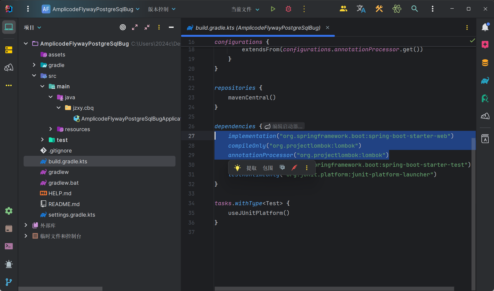

2. config postgreSql by Amplicode

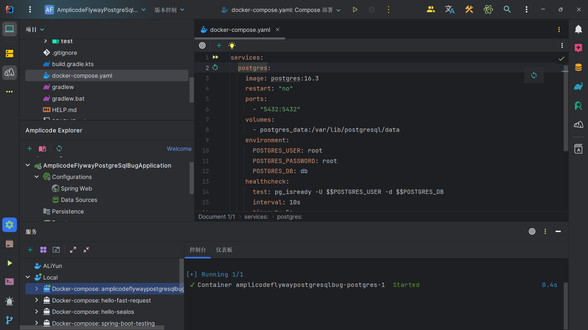

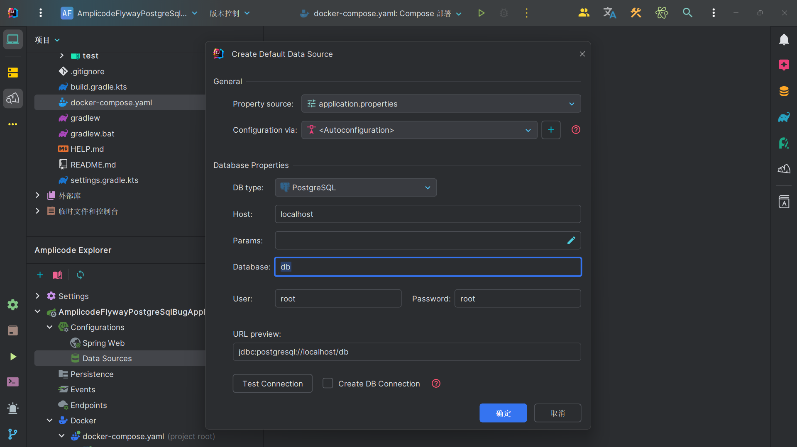

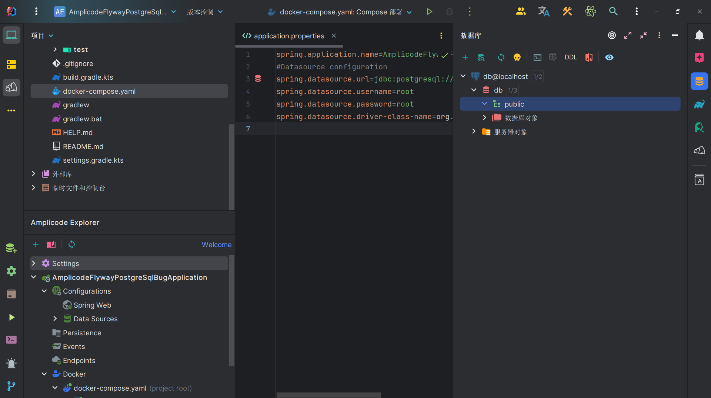

3. config spring data jpa and flyway

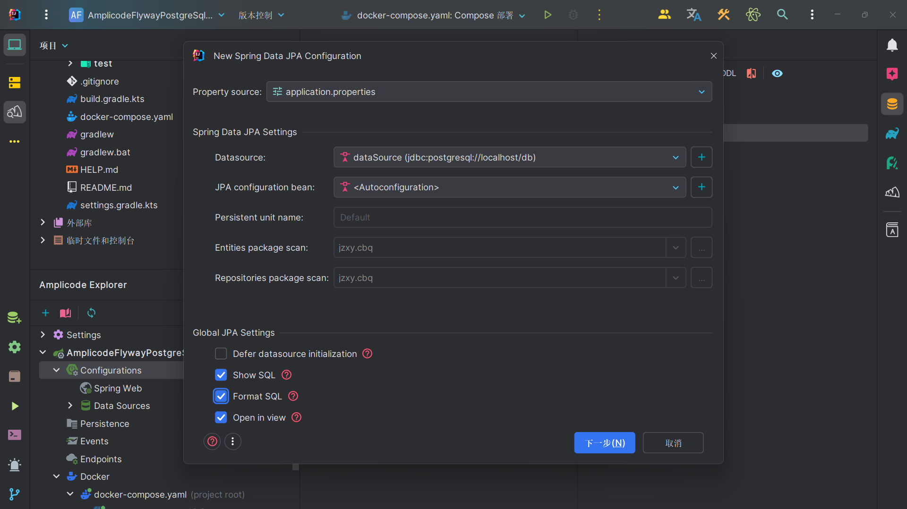

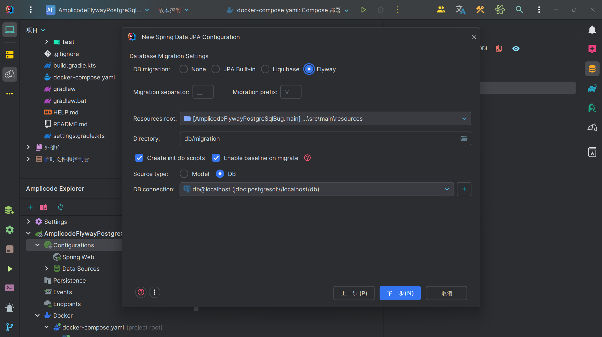

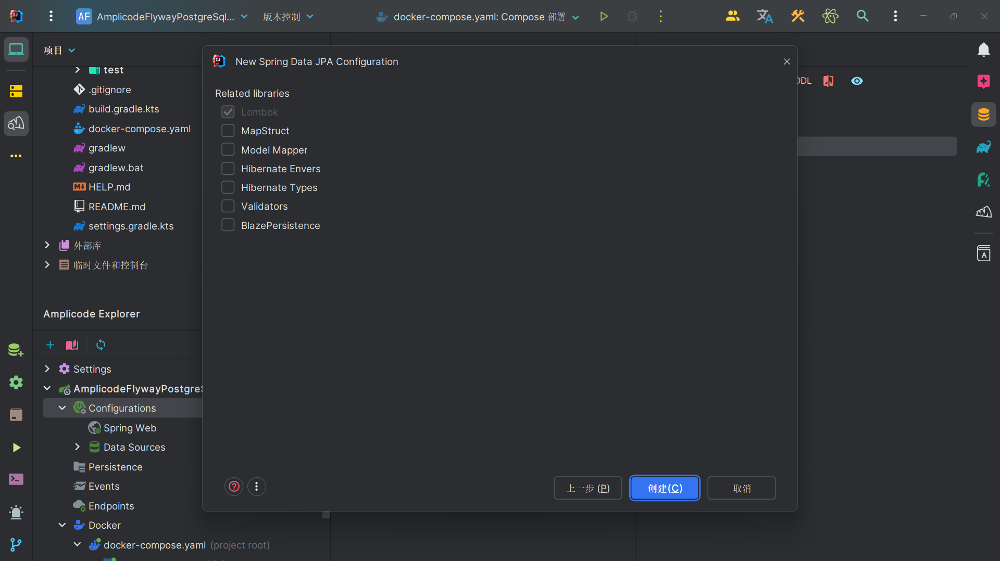

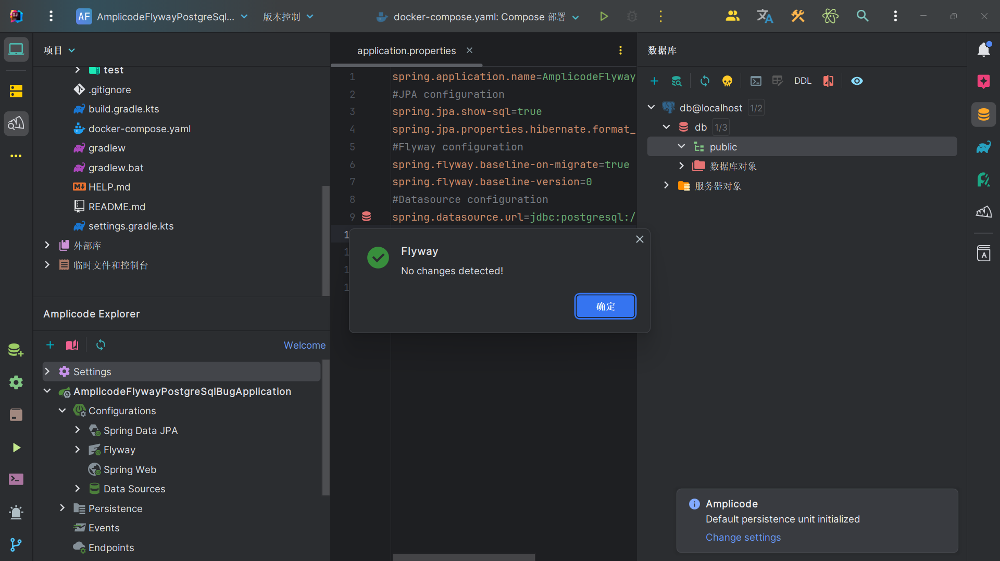

4. start application

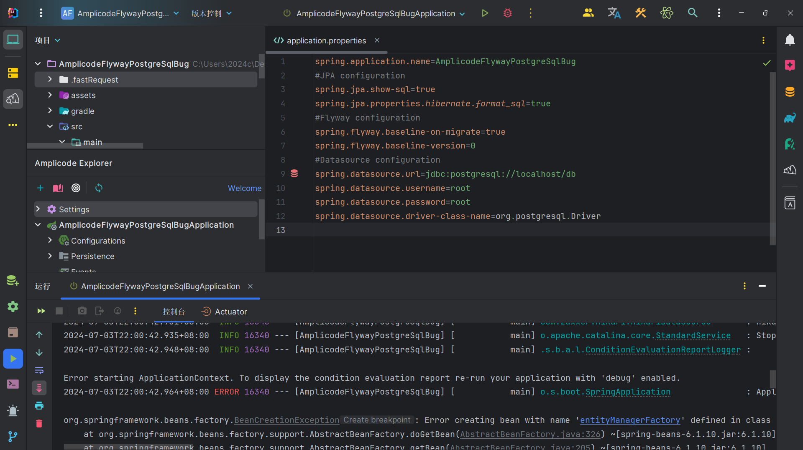

bug info （Unsupported Database: PostgreSQL 16.3）

detailed: [bug-info.txt](./assets/bug-info.txt)

```java
org.springframework.beans.factory.BeanCreationException:
Error creating
bean with
name 'entityManagerFactory'
defined in

class path resource [org/springframework/boot/autoconfigure/orm/jpa/HibernateJpaConfiguration .class]:
Failed to
initialize dependency 'flywayInitializer'
of LoadTimeWeaverAware
bean 'entityManagerFactory':
Error creating
bean with
name 'flywayInitializer'
defined in

class path resource [org/springframework/boot/autoconfigure/flyway/FlywayAutoConfiguration$FlywayConfiguration .class]:
Unsupported Database:PostgreSQL 16.3
```

## 二、Version Info

| IntelliJ IDEA 2024.1.2 (Ultimate Edition) | IU-241.17011.79                                                                                                                                                                            |
|-------------------------------------------|--------------------------------------------------------------------------------------------------------------------------------------------------------------------------------------------|
| JDK                                       | java version "17.0.10" 2024-01-16 LTS<br/>Java(TM) SE Runtime Environment (build 17.0.10+11-LTS-240)<br/>Java HotSpot(TM) 64-Bit Server VM (build 17.0.10+11-LTS-240, mixed mode, sharing) |
| Amplicode                                 | 2024.1.4-241-EAP                                                                                                                                                                           |
| Gradle                                    | 8.8                                                                                                                                                                                        |
| Windows                                   | 22631.3810(23H2)                                                                                                                                                                           |

## 三、My solution

- https://stackoverflow.com/questions/78539678/using-postgres-16-with-spring-boot-3-3-0

add `flyway-database-postgresql` to `build.gradle.kts`

```groovy
    runtimeOnly("org.flywaydb:flyway-database-postgresql")
```

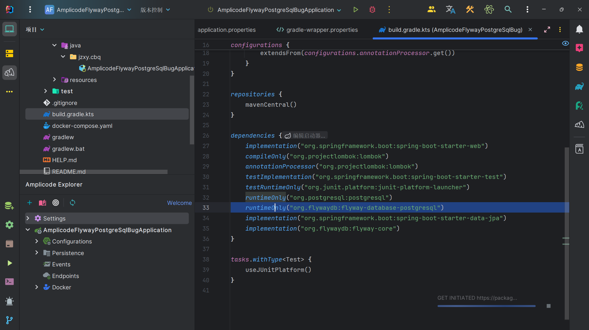

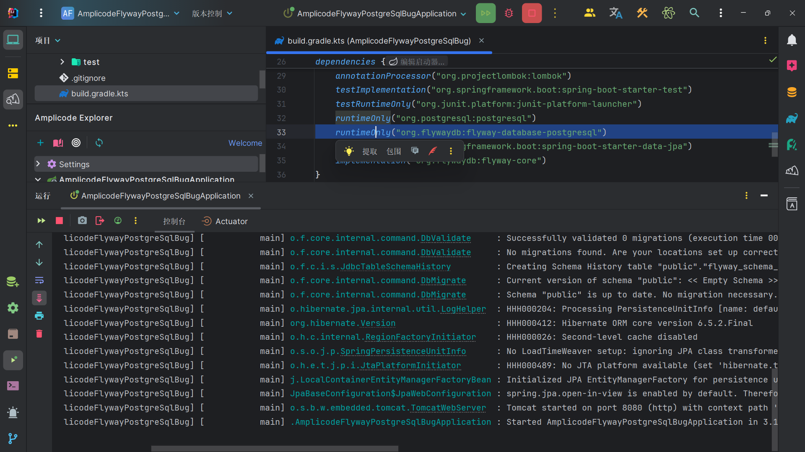
